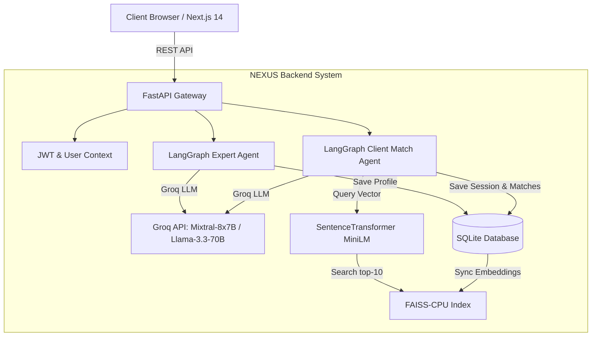

# NEXUS — MindGigs Agentic AI Marketplace System

> **NEXUS** is a dual-sided, state-machine driven AI marketplace assistant for MindGigs.com. Built with **FastAPI**, **LangGraph**, **Groq LLM API**, **FAISS-CPU**, and **Next.js 14**, NEXUS revolutionizes expert onboarding and client matching through natural language reasoning.

---

## 🌟 Key Features

### 1. 🤖 Expert Agent Onboarding (`agents/expert/`)
* **Natural Language Profile Generation**: Converts raw, unstructured expert descriptions into high-converting professional headlines, structured bios, skill tags, and categorized service offerings.
* **Ambiguity & Quality Control**: Evaluates profile completeness and calculates a confidence score. Automatically triggers clarification questions if key details are missing.
* **Asset Validation Engine**: Enforces file requirements (PDF, ZIP, EPUB) for digital products and ebooks prior to marketplace publishing.
* **Live Preview & One-Click Publishing**: Generates interactive preview cards for human approval before persisting to SQLite and indexing in FAISS vector space.

### 2. ⚡ Client Matching Agent (`agents/client/`)
* **Conversational Requirement Briefing**: Translates client problem statements into structured JSON briefs containing category, goals, urgency, and skill constraints.
* **FAISS Semantic Search**: Queries pre-computed 384-dimensional `sentence-transformers/all-MiniLM-L6-v2` embeddings for sub-millisecond vector similarity retrieval across candidate experts.
* **Groq Premium Model LLM Ranking**: Re-ranks candidates with personalized reasoning explaining exactly why each expert is uniquely qualified.

### 3. 🎨 MindGigs Dark Mode UI (`nexus-frontend/`)
* Built with **Next.js 14 (App Router)**, **TypeScript**, and **Tailwind CSS**.
* **MindGigs Aesthetics**: Dark slate canvas (`#0A0A0A`), card containers (`#141414`), and vibrant Neon Green accents (`#00FF88`).
* **Dual Mode Header Toggle**: Seamlessly switch between *Expert Mode* and *Client Mode*.

---

## 🚀 Quick Start Guide

### Prerequisites
* Python 3.11+
* Node.js 18+ & npm
* Groq API Key (Set in `nexus-backend/.env`)

---

### Step 1: Launch Backend API Server

```bash
cd nexus-backend

# Activate virtual environment
.\venv\Scripts\activate

# Install dependencies (if not already installed)
pip install -r requirements.txt

# Start FastAPI server with Uvicorn
uvicorn main:app --host 0.0.0.0 --port 8000 --reload
```

* Backend API Docs: `http://localhost:8000/docs`
* Health Check: `http://localhost:8000/api/v1/health`

*Note: On initial startup, `main.py` automatically initializes the SQLite database schema (`nexus.db`), seeds 30 realistic experts across 10 categories, and generates the FAISS vector index (`embeddings.index`).*

---

### Step 2: Launch Next.js Frontend

```bash
cd nexus-frontend

# Install dependencies
npm install

# Start Next.js Development Server
npm run dev
```

* Frontend UI: `http://localhost:3000`

---

## 🏗 System Architecture



---

## 📁 Repository Structure

```
nexus-project/
├── nexus-backend/
│   ├── main.py                # FastAPI app entry point & lifespan manager
│   ├── config.py              # Settings & environment configuration
│   ├── database/
│   │   ├── connection.py      # Async SQLAlchemy SQLite engine
│   │   ├── models.py          # Database ORM schema
│   │   └── seed.py            # Seeding script with 30 experts across 10 categories
│   ├── services/
│   │   └── file_handler.py    # Strict digital product file validation rules
│   ├── agents/
│   │   ├── shared/
│   │   │   ├── embedding.py   # Sentence-Transformers + FAISS manager
│   │   │   ├── llm_client.py  # Groq API client with backoff retries & fallback
│   │   │   └── types.py       # Pydantic v2 schemas
│   │   ├── expert/            # Expert Onboarding State Graph
│   │   └── client/            # Client Match State Graph
│   └── api/                   # FastAPI route controllers
└── nexus-frontend/
    ├── app/                   # Next.js App Router pages (onboard, find, dashboard)
    ├── components/            # UI Components (ChatInterface, PreviewCard, MatchCard, etc.)
    └── lib/                   # API client and TypeScript definitions
```
